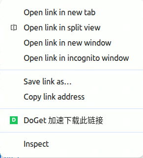
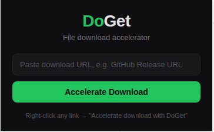

<div align="center">

# ⚡ DoGet Download Accelerator

[](https://chrome.google.com/webstore)
[](LICENSE)
[](https://developer.chrome.com/docs/extensions/mv3/)

**Right-click any download link to accelerate it via [DoGet](https://doget.nocsdn.com/).**
Supports GitHub Releases and general file downloads.

**简体中文** | [English](./docs/README.en.md)

</div>

---

## ✨ Features

- **Right-click to accelerate** — Right-click any download link, select "DoGet 加速下载此链接", done.
- **Popup manual input** — Click the extension icon to paste and accelerate any URL.
- **GitHub Release support** — Directly accelerate `github.com` release asset downloads.
- **Minimal permissions** — Only requests `contextMenus` and `downloads` permissions.
- **Manifest V3** — Built on the latest Chrome Extension platform.
- **Dark theme popup** — Clean, minimal UI.

## 📸 Screenshots

<div align="center">

| Right-click Menu | Popup UI |
|---|---|
|  |  |

</div>

## 🚀 Installation

### From Source (Developer Mode)

1. Clone the repository:
   ```bash
   git clone https://github.com/weisha1991/doget-chrome-extension.git
   cd doget-chrome-extension
   ```

2. Open Chrome and navigate to `chrome://extensions/`

3. Enable **Developer mode** (toggle in the top-right corner)

4. Click **Load unpacked**

5. Select the `doget-chrome-extension` directory

### From Chrome Web Store

> TODO: Add link after publishing.

## 📖 Usage

### Method 1: Right-click Context Menu (Recommended)

1. Browse any webpage with download links (e.g., GitHub Releases page)
2. **Right-click** on the download link
3. Select **「DoGet 加速下载此链接」**
4. Chrome will prompt you to save the file — the download is now accelerated

### Method 2: Popup Manual Input

1. Click the DoGet extension icon in your browser toolbar
2. Paste the download URL into the input field
3. Click **加速下载**

## 🔧 How It Works

The extension calls the [DoGet API](https://doget.nocsdn.com/) to obtain an accelerated download URL:

```
1. Original URL → GET /api/get_download_token?url={url}
2. API returns → { data: "<token>" }
3. Download → GET /api/download?token={token}
```

All acceleration is handled server-side by DoGet. The extension only orchestrates the API call and triggers Chrome's download manager.

## 🛠️ Development

### Prerequisites

- [Node.js](https://nodejs.org/) >= 18
- npm or [pnpm](https://pnpm.io/)

### Setup

```bash
# Install dependencies
npm install

# Lint check
npm run lint

# Format check
npm run format:check

# Package extension as .zip for Chrome Web Store
npm run build
```

### Project Structure

```
doget-chrome-extension/
├── _locales/            # i18n message bundles
│   ├── en/              # English
│   └── zh_CN/           # Simplified Chinese
├── icons/               # Extension icons (16/48/128px)
├── src/
│   ├── background.js    # Service worker (context menu + API)
│   ├── popup.html       # Popup UI
│   ├── popup.css        # Popup styles
│   └── popup.js         # Popup logic
├── manifest.json        # Extension manifest (MV3)
├── package.json         # Dev tooling
├── .prettierrc          # Prettier config
├── .gitignore
├── CHANGELOG.md
├── CONTRIBUTING.md
├── LICENSE
└── README.md
```

## 🤝 Contributing

Contributions are welcome! See [CONTRIBUTING.md](CONTRIBUTING.md) for guidelines.

## 📄 License

This project is licensed under the MIT License — see the [LICENSE](LICENSE) file for details.

## 🙏 Acknowledgments

- [DoGet](https://doget.nocsdn.com/) — Free file download acceleration service
- Inspired by [refined-github](https://github.com/refined-github/refined-github) and [OctoLinker](https://github.com/OctoLinker/OctoLinker)
